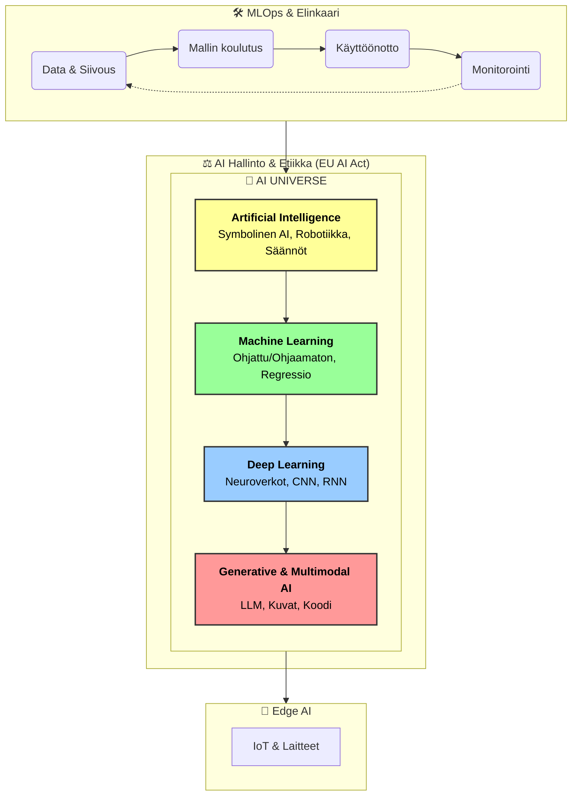

Tässä on valmis Markdown-sisältö (`.md`), jonka voit kopioida suoraan ja tallentaa esimerkiksi nimellä `README.md` tai `AI_Universe.md` GitHub-repositorioosi.

Olen sisällyttänyt siihen:
1.  **Tekstikuvauksen** ja hierarkian.
2.  **Mermaid.js -kaavion**, joka renderöityy automaattisesti kaaviona GitHubissa.
3.  **Python-koodin**, jolla voit generoida "sipulimallin" kuvatiedostoksi.

***

```markdown
# AI Universe 2.0 (2025 Edition)

Tämä dokumentti kuvaa tekoälyn nykyaikaista maisemaa. Se päivittää perinteisen "AI Universe" -mallin vastaamaan vuoden 2025 tilaa, ottaen huomioon generatiivisen tekoälyn nousun, MLOps-prosessit sekä etiikan ja hallinnon merkityksen.

## 🌌 Tekoälyn Hierarkia (Sipulimalli)

Tekoäly ei ole yksi teknologia, vaan kerroksittainen kokonaisuus, jossa syvemmät tasot ovat edellisten osajoukkoja.

### 1. Ydin: Generatiivinen & Multimodaalinen AI 🎨💬
Tämä on tämän hetken nopeimmin kehittyvä alue. Se ei vain luokittele dataa, vaan **luo uutta**.
*   **Mitä se tekee:** Luo tekstiä, kuvia, ääntä, koodia ja videota.
*   **Multimodal AI:** Kyky käsitellä useita syötteitä (esim. kuva + teksti) yhtä aikaa.
*   **Esimerkit:** ChatGPT (teksti), DALL·E (kuva), GitHub Copilot (koodi), Sora (video).

### 2. Syväoppiminen (Deep Learning) 🧠
Generatiivinen tekoäly perustuu tähän kerrokseen. Se käyttää monikerroksisia neuroverkkoja oppiakseen monimutkaisia rakenteita.
*   **Teknologiat:**
    *   **Transformers:** Kielimallien (LLM) perusta.
    *   **CNN (Convolutional Neural Networks):** Kuvantunnistus ja konenäkö.
    *   **RNN (Recurrent Neural Networks):** Aikasarjat ja puheentunnistus.

### 3. Koneoppiminen (Machine Learning) 📊
Laaja kattokäsite algoritmeille, jotka oppivat datasta ilman sääntöpohjaista ohjelmointia.
*   **Ohjattu oppiminen (Supervised):** Ennustaminen ja luokittelu (esim. roskapostisuodattimet, hintaennusteet).
*   **Ohjaamaton oppiminen (Unsupervised):** Datan ryhmittely ja hahmontunnistus (esim. asiakassegmentointi).
*   **Vahvistusoppiminen (Reinforcement Learning):** Oppiminen yrityksen ja erehdyksen kautta (esim. pelit, robotiikka).

### 4. Tekoäly (Artificial Intelligence) 🤖
Ylin käsite, joka kattaa kaiken koneellisen älykkyyden.
*   **Sisältö:** Sisältää koneoppimisen lisäksi "vanhan koulukunnan" symbolisen tekoälyn, sääntöpohjaiset järjestelmät (esim. asiantuntijajärjestelmät) ja robotiikan.

---

## 🔄 Prosessit ja Hallinto (Konteksti)

Nykyaikainen tekoäly ei ole vain staattinen malli, vaan se vaatii ympärilleen prosessit ja valvonnan.

### 🛠️ MLOps & Elinkaari (AI Lifecycle)
Tekoäly on prosessi, ei projekti. MLOps (Machine Learning Operations) varmistaa mallien toimivuuden tuotannossa.
1.  **Data:** Keräys, siivous ja jako (Training/Test/Validation).
2.  **Koulutus (Training):** Mallin opettaminen datalla.
3.  **Käyttöönotto (Deployment):** Mallin vieminen tuotantoon osaksi sovellusta.
4.  **Monitorointi:** Suorituskyvyn seuranta ja uudelleenkoulutus (Drift detection).

### ⚖️ Etiikka & Hallinto (AI Governance)
Tekoälyn "ilmakehä", joka asettaa rajat toiminnalle.
*   **EU AI Act:** Lainsäädäntö, joka luokittelee tekoälyn riskitasot.
*   **Luotettavuus (Trustworthy AI):** Läpinäkyvyys, reiluus (biasin välttäminen) ja turvallisuus.

### 📱 Edge AI (Reunatekoäly)
Laskennan siirtäminen pilvestä laitteisiin.
*   **Hyödyt:** Yksityisyys, nopeus (latenssi) ja toimintavarmuus ilman internetiä.
*   **Esimerkit:** Älypuhelimen kasvojentunnistus, IoT-laitteet.

---

## 📊 Visuaalinen Kaavio (Mermaid.js)

Tämä kaavio renderöityy automaattisesti GitHubissa:



---

## 🐍 Python-koodi kuvan luomiseen

Voit luoda tarkan "sipulimalli"-kuvan ajamalla tämän koodin Python-ympäristössä (esim. Jupyter Notebook):

```python
import matplotlib.pyplot as plt

def draw_ai_universe():
    # Määritellään värit ja fontit
    colors = ['#e3f2fd', '#b3e5fc', '#81d4fa', '#4fc3f7']
    labels = [
        'TEKOÄLY (AI)\nSymbolinen AI, Robotiikka',
        'KONEOPPIMINEN (ML)\nOhjattu/Ohjaamaton oppiminen',
        'SYVÄOPPIMINEN (DL)\nNeuroverkot (CNN, RNN)',
        'GENERATIIVINEN AI\n(ChatGPT, Kuvat, Koodi)'
    ]
    radii = [1.0, 0.75, 0.5, 0.25]
    
    fig, ax = plt.subplots(figsize=(10, 10))
    
    # Piirretään kehät
    for radius, color, label in zip(radii, colors, labels):
        circle = plt.Circle((0.5, 0.5), radius/2, color=color, ec='black', linewidth=1.5)
        ax.add_artist(circle)
        # Sijoitetaan teksti kehän yläosaan
        plt.text(0.5, 0.5 + (radius/2)*0.75, label, 
                 ha='center', va='center', fontsize=11, fontweight='bold')

    # Lisätään kontekstilaatikot
    plt.text(0.05, 0.9, '⚖️ HALLINTO & ETIIKKA\n(EU AI Act, Turvallisuus)', 
             bbox=dict(facecolor='white', edgecolor='black', boxstyle='round,pad=0.5'), fontsize=10)
    
    plt.text(0.05, 0.1, '🛠️ MLOps (ELINKAARI)\nData -> Malli -> Tuotanto', 
             bbox=dict(facecolor='white', edgecolor='black', boxstyle='round,pad=0.5'), fontsize=10)

    plt.text(0.75, 0.1, '📱 EDGE AI\n(Laitteet & IoT)', 
             bbox=dict(facecolor='white', edgecolor='black', boxstyle='round,pad=0.5'), fontsize=10)

    ax.set_xlim(0, 1)
    ax.set_ylim(0, 1)
    ax.axis('off')
    plt.title('AI Universe 2.0 (2025)', fontsize=16, fontweight='bold', pad=20)
    plt.show()

if __name__ == "__main__":
    draw_ai_universe()
```
```
